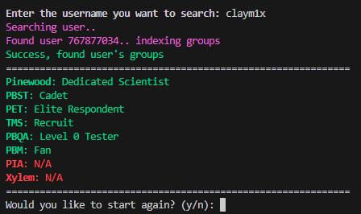
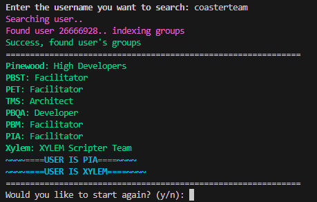

# Pinewood User Lookup 2.0

Hiya, its me again.
I remade the user lookup, but in python. 
This is designed for the group [Pinewood Builders](https://www.roblox.com/groups/159511/Pinewood-Builders) on Roblox

## What this does
This simplifies getting a user's ranks in groups.
This is good if you are a subgroup mr/hr and hear about someone who may be breaking handbook rules.

## How to use it
[It can be used on replit](https://replit.com/@ClayPotato/PinewoodPlayerLookup?v=1) if you do not want to download the files

You need [Python3](https://www.python.org/downloads/)+ installed on a windows machine, along with this source file. All you need to do is run `mainrunner.py` and your good!

Thats basically it, I need to check if it works on MacOs as frankly I am too lazy right now. Anyways enjoy and please tell me if there is a bug.

Thank you everyone for checking this out <3